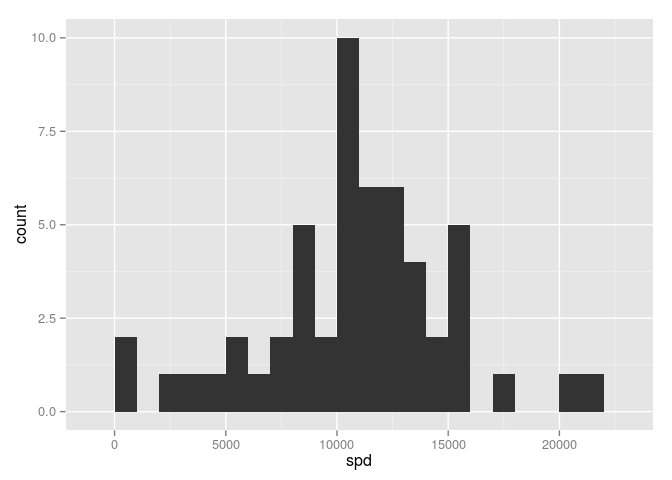
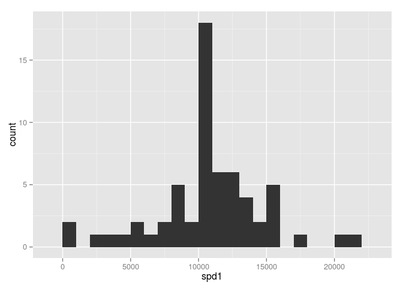
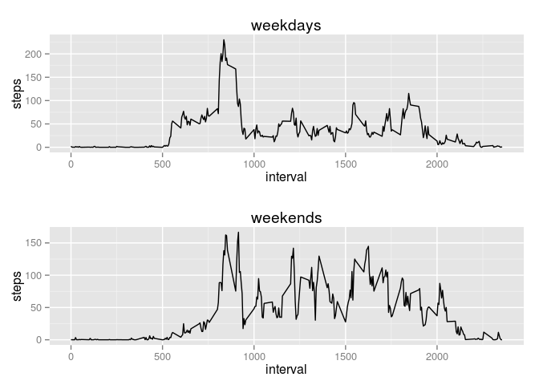

# PA1_template.Rmd
Scotch  
07/18/2014  
# Reproducible Research: Peer Assessment 1

## Loading and preprocessing the data
Let's create two data frames: with and without NAs

```r
data <- read.csv("activity.csv")
datacc <- data[complete.cases(data),]
```


## What is mean total number of steps taken per day?
Factor x is the same as datacc$date. Let's see how total number of steps distribution looks like. I'd like to use "ggplot2" package here, so it should be installed.  

```r
#install.packages("ggplot2")
library(ggplot2)

x <- factor(datacc$date)
x_lev <- attr(x,"levels")
n <- length(x_lev)
spd <- numeric(n)
for (i in 1:n){
     spd[i] <- sum(datacc$steps[x == x_lev[i]]) 
}
qplot(spd, binwidth=1000)
```

 

```r
spd_mean <- mean(spd)
spd_median <- median(spd)
```
Mean total number of steps is equal to 1.0766 &times; 10<sup>4</sup>, median - 1.0765 &times; 10<sup>4</sup>.

## What is the average daily activity pattern?
Average number of steps through the day.

```r
y <- factor(datacc$interval)
y_lev <- attr(y, "levels")
intervals <- as.numeric(y_lev)
m <- length(y_lev)
spi <- numeric(m)
for (i in 1:m){
     spi[i] <- mean(datacc$steps[y == y_lev[i]])     
}

plot(intervals, spi, type="l")
```

 

```r
intervals_max <- intervals[which(spi==max(spi))]
```
The most active interval is 835- 840.

## Imputing missing values

```r
s <- sum(is.na(data$steps))
```
There are 2304 NA values. There is no information about some days at all. I prefer to fill free places with average number of steps for corresponding interval. So if we have NA in the interval 220-225 i would like to see there average number of steps for 220-225 interval through other days. This filling will not change mean of the distribution.


```r
for (i in 1:m){
     int <- y==y_lev[i]
     int_na <- is.na(data$steps[int])
     data$steps[int][int_na] <- spi[i]*rep(1,sum(int_na))
}

x1 <- factor(data$date)
x1_lev <- attr(x1,"levels")
n1 <- length(x1_lev)
spd1 <- numeric(n1)
for (i in 1:n1){
     spd1[i] <- sum(data$steps[x1 == x1_lev[i]]) 
}
qplot(spd1, binwidth=1000)
```

 

```r
spd1_mean <- mean(spd1)
spd1_median <- median(spd1)
```

The distribution changed a bit. There are more days with average number of steps now. Mean is the same - 1.0766 &times; 10<sup>4</sup>, median value moved to the mean - 1.0766 &times; 10<sup>4</sup>.


## Are there differences in activity patterns between weekdays and weekends?
There is a nice functions isWeekday() and isWeekend() in the package "timeDate". Let's use them (we should install it first). Factor variable name is "wd". I need also other two packages "grid" and "gridExtra" to plot two graphs on one page.

```r
#install.packages("timeDate")
#install.packages("grid")
#install.packages("gridExtra")

library(timeDate)

wdf <- isWeekend(data$date)
wd <- character(length(wdf))
wd[wdf] <- rep("weekend", length(wd[wdf]))
wd[!wdf] <- rep("weekday", length(wd[!wdf]))
wd <- factor(wd)

y1 <- factor(data$interval)
data <- cbind(data,y1)
y1_lev <- attr(y1, "levels")
intervals1 <- as.numeric(y1_lev)
m1 <- length(y1_lev)
spi_wd <- numeric(m1)
spi_we <- numeric(m1)

data_wd <- split(data,wd)[[1]]
data_we <- split(data,wd)[[2]]
for (i in 1:m1){
     spi_wd[i] <- mean(data_wd[data_wd$y1 == y1_lev[i], 1])
     spi_we[i] <- mean(data_we[data_we$y1 == y1_lev[i], 1])
}

library(grid)
library(gridExtra)

df_wd <- data.frame(intervals, spi_wd)
names(df_wd) <- c("interval", "steps")
df_we <- data.frame(intervals, spi_we)
names(df_we) <- c("interval", "steps")
p1 <- ggplot(df_wd, aes(x=interval, y=steps))+geom_line()+ggtitle("weekdays")
p2 <- ggplot(df_we, aes(x=interval, y=steps))+geom_line()+ggtitle("weekends")
grid.arrange(p1, p2, ncol = 1)
```

 

